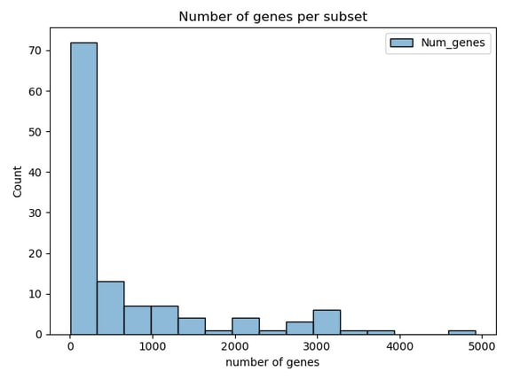

# Transcriptomics-based longevity drug discovery

## Introduction

The process of aging is associated with human morbidity and mortality. To slow down this process scientists are trying to find geroprotective compounds, which can increase the lifespan. One of the approaches was applied by Janssens et al. In this study authors trained random forest models on GTEx dataset and applied them to drug-induced transcriptomes to identify molecules with the highest geroprotective potential. For this purpose 2 trancriptomics daatasets were utilized: GTEx and CMap. As a result, authors found several candidate molecules and perform experimental validation of the most promising ones. By testing the top candidates in C.elegans. They identified two Hsp90 inhibitors – monorden and tanespimycin which extended the lifespan on worms.

## Results

Data procession and analysis was made as close as its described in the original [article](https://www.cell.com/cell-reports/fulltext/S2211-1247%2819%2930360-2?_returnURL=https%3A%2F%2Flinkinghub.elsevier.com%2Fretrieve%2Fpii%2FS2211124719303602%3Fshowall%3Dtrue#fig2) [1].

[Colab notebook](https://colab.research.google.com/drive/17Ei-vA9AGbw_U1AW5qFho9rWfaryLRPw?usp=sharing) is available to access.

[GTEX processing](https://drive.google.com/file/d/1YuJaGECk4oJyKm168ouCIEzPQgUneakC/view?usp=sharing)

### **GTEx data processing**

Data was processed in python. Package versions: python=3.10.0, pandas=2.3.3 GTEx version 10 TPM count matrix and corresponding annotation was downloaded from [gtexportal](https://gtexportal.org/home/downloads/adult-gtex/bulk_tissue_expression). The dataset was composed from 19618 samples from 6 decade-sized age groups with expression values for 59033 genes. Data preparation included 3 main steps. First, transcripts which TPM values were less than 0.1 in at least 80% of samples were removed. Data was log2 transformed after adding a pseudocount. Only samples with RIN greater or equal to 6 and marked as usable were selected. Finally, samples from 70-79 age group were removed due to much lower number of samples relative to other age groups. On the second step, data was splitted by tissue, gender and combination of age groups. Each combination included one young age bin and one old age bin. On the third step, feature selection was performed for each subset separately. Only genes that were present in CMap were selected. Then, 10% less abundant transcripts were removed, and finally only differentially expressed genes between young and old groups were retained (p-value \< 0.01).



Figure 1. Histogramm of genes number after filtration's in each sample.

### **CMap data processing**

CMap data was processed with R=4.4.2 (for raw data) and python=3.10, pandas=2.3.3 (for expression matrices). Due to inability to download prepared amplitude matrix, we prepared data from raw microarray data. 7 volumes with over 7000 raw data for CMap 1 build 2 was downloaded from <https://clue.io/data/CMB02#B02>. To simplify analysis, we tested 110 unique drugs from HG-U133A assay and 1267 unique drugs from combination of HG-U133A and HT_HG-U133A assays. Each drug had several entries in dataset corresponding to different concentrations, cell line and assay type. For simplicity, we randomly selected one entry for each considered drug. Raw files were processed with oligo R package (version 1.70.1). Normalization of raw intensities was made with RMA algorithm implemented in oligo. Obtained expression matrices were further processed in python. For each drug, log2FC of treatment to corresponding control was calculated. In case of multiple controls, mean value of them was found before log2FC calculation. Then, Affymetrix probe ids were converted to ENSG ids. For genes with multiple probe ids present, median value was taken.

### **Random Forest generation**

No changes were made from the original article.

### **Drug-induced datasets generation**

The key assumption made during processing is to use addition of logFC from median datasets and CMAP.

### Geroprotective score

After p-value correction no significant genes were found.

Top 10 drugs from 110 drug list (in bold - its shown that there is an effect on aging, from DrugAge db 16.12.2025):\

|                             |           |
|-----------------------------|-----------|
| **drug**                    | **Score** |
| flufenamic acid             | 10        |
| **verapamil**               | 9         |
| dexverapamil                | 9         |
| HNMPA-(AM)3                 | 9         |
| **resveratrol**             | 9         |
| **colchicine**              | 9         |
| exemestane                  | 8         |
| sulfasalazine               | 8         |
| acetylsalicylic acid        | 8         |
| arachidonyltrifluoromethane | 8         |

Top 10 drugs from 1267 drug list (in bold - its shown that there is an effect on aging, from DrugAge db 16.12.2025):

|                |           |
|----------------|-----------|
| **drug**       | **Score** |
| lomustine      | 14        |
| **metformin**  | 12        |
| ioxaglic acid  | 12        |
| irinotecan     | 11        |
| famotidine     | 11        |
| nifedipine     | 11        |
| **chrysin**    | 11        |
| digoxin        | 11        |
| **anisomycin** | 11        |
| valinomycin    | 10        |

Drugs which were top-15 and have some effect on aging it the original study:

|                  |           |
|------------------|-----------|
| **drug**         | **Score** |
| trichostatin A   | 8         |
| genistein        | 8         |
| haloperidol      | 8         |
| tanespimycin     | 7         |
| tretinoin        | 5         |
| prochlorperazine | 5         |
| LY-294002        | 5         |
| estradiol        | 5         |
| wortmannin       | 4         |
| valproic acid    | 3         |
| trifluoperazine  | 3         |
| monorden         | 3         |
| fulvestrant      | 3         |
| santonin         | 5         |

## Discussion

As we don't have significant founds, we analysed top scores of each datasets. Among them for many drugs there is no known effect on longevity. Drugs, which have effect on longevity and have high score: metformin is popular geroprotective agent. Its mechanisms include AMPK activation and mTOR inhibition. Colchicine primarily an anti-inflammatory agent. Resveratrol a sirtuin activator found in red grapes. Verapamil is a calcium channel blocker used in hypertension. Anisomycin a protein synthesis inhibitor, point to the importance of growth signaling and translational regulation in aging. Chrysin a flavonoid found in honey and various plants, has demonstrated antioxidant and anti-inflammatory properties in preclinical studies.

There we several troubles with CMAP dataset and we randomly choose concentration for each drug in case there we multiple of them, but this approach seems not to be reasonable. Recent article [2] comparing CMAP 1 and CMAP 2 show huge effect of the drug concentration of the cells, especially then concentration significantly higher than the biologically correct one. Also, they show reproducibility issues withing and between these 2 datasets.

For further research it is wise to try more modern datasets with drug infuence, especially RNA-seq or scRNA-seq and not microarray data.

## Credits

Vladislava Sagitova preprocessed GTEx and CMap datasets

Anastasia Soldatenkova implemened Random Forest models and performed geroprotectors selection

## References

```{bibliography}
:style: plain
:filter: docname in docnames

[1] Georges E Janssens, Xin-Xuan Lin, Lluís Millan-Ariño, Alan Kavšek, Ilke Sen, Renée I Seinstra, Nicholas Stroustrup, Ellen AA Nollen, and Christian G Riedel. Transcriptomics-based screening identifies pharmacological inhibition of hsp90 as a means to defer aging. Cell reports, 27(2):467–480, 2019. URL: https://doi.org/10.1016/j.celrep.2019.03.044.

[2] Lim, N., Pavlidis, P. Evaluation of connectivity map shows limited reproducibility in drug repositioning. Sci Rep 11, 17624 (2021). https://doi.org/10.1038/s41598-021-97005-z
```
