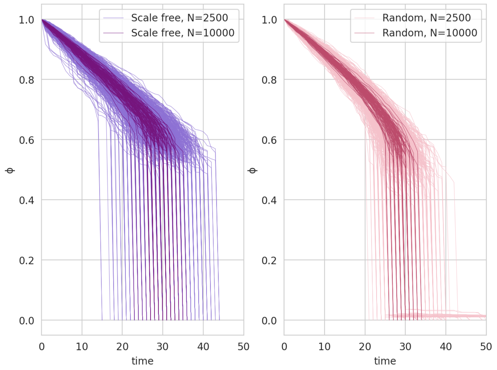
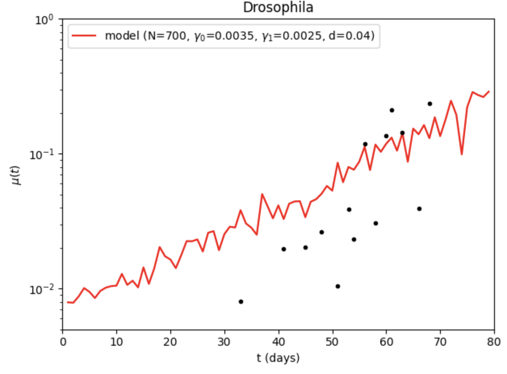
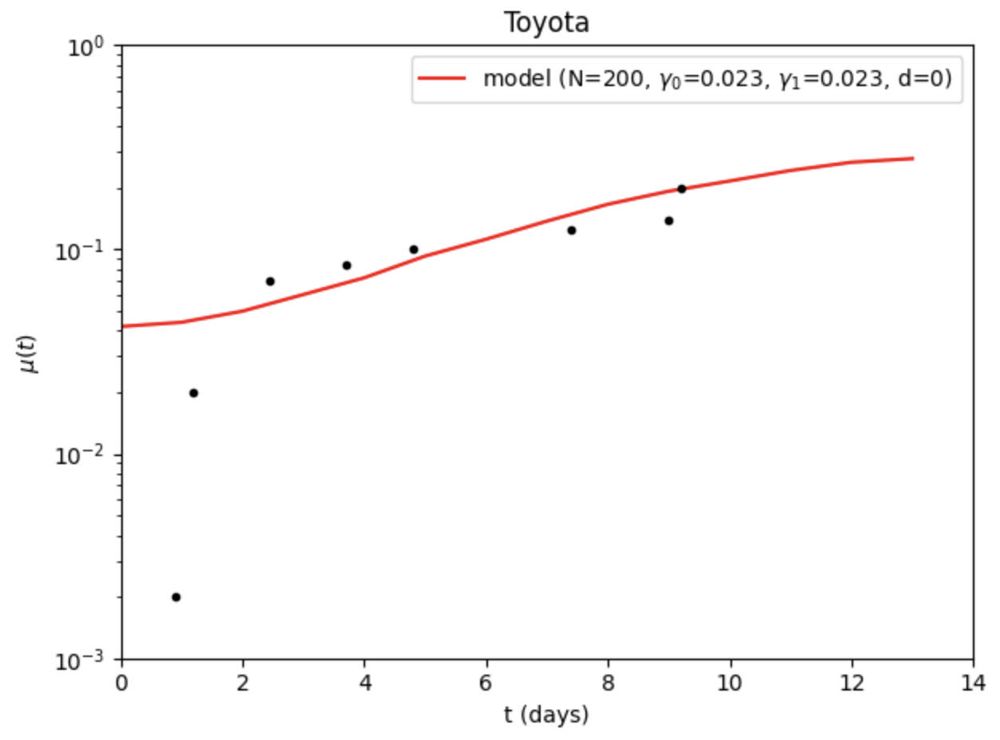
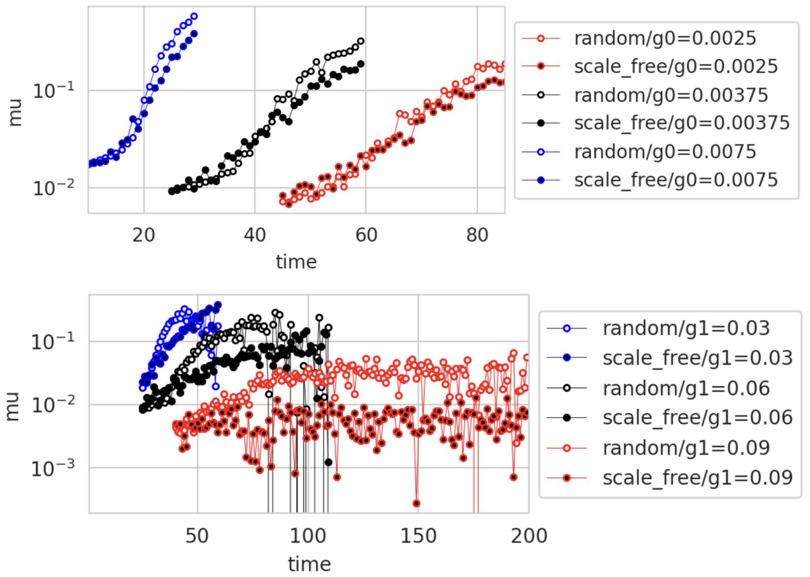
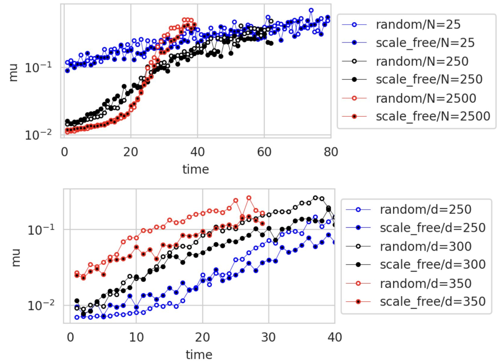
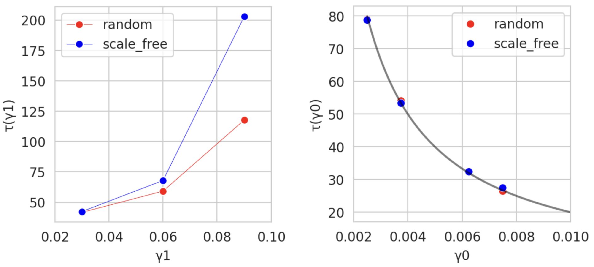
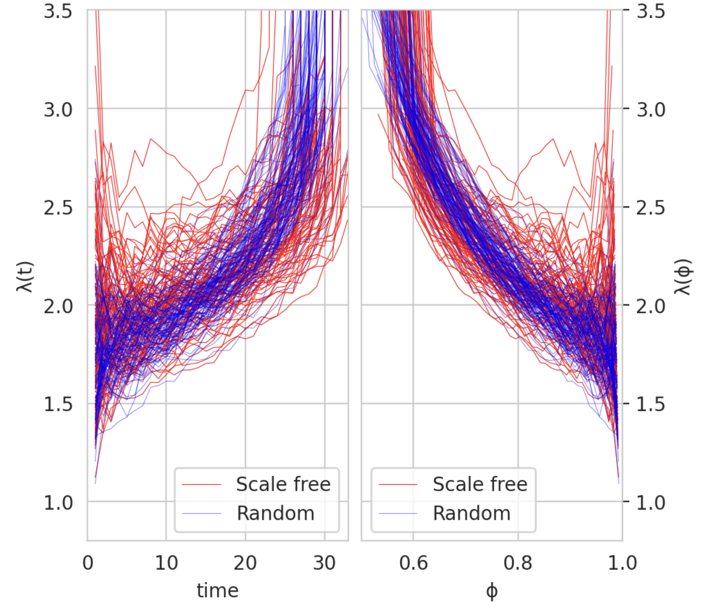
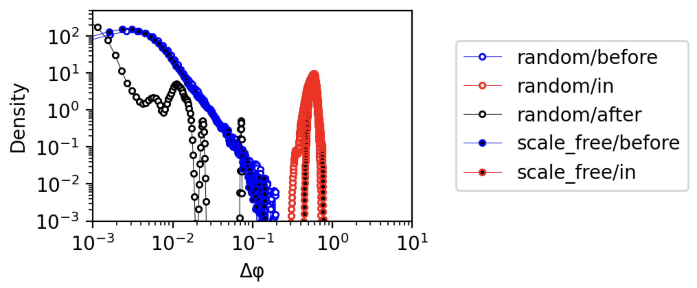

# Aging in complex interdependency networks

This project is devoted to reproduction of the paper "Aging in complex interdependency networks" by Dervis C. Vural, Greg Morrison and L. Mahadevan. In this project, we reconstructed theoretical results from the article. Specifically, we tried to investigate what is common between the aging of cars and the aging of humans.

## Introduction

In complex structures such as organisms and machines, it can be found that $μ(t)$, varies and usually increases with time. In living systems, $μ(t)$ increases exponentially (commonly known as Gompertz's law) until it reaches a plateau at the end of life. Moreover, the functional form of $μ(t)$ is remarkably similar in a wide range of organisms.

Classical mechanistic (mutation accumulation theory) and evolutionary (antagonistic pleiotropy) theories of aging do not fully explain the observed mortality curves, so it is worth considering aging as a consequence of a complex network of interdependencies between parts of the system. For this purpose, random and non-random networks are built, they are damaged and repaired, and it is shown that such a purely network model reproduces empirical mortality curves of several species.

## Model

### An organism as a network of dependencies

- An organism is represented as a set of nodes with directed edges: nodes — genes, cells, tissues, organs with functions
- Directed edge $A \rightarrow B$: B depends on A (energy, enzymes, mechanical support, etc.)
- The evolution of an organism is considered as a gradual addition of new nodes and edges
- Linking a new node with an existing one can be: 
  - with equal probability (**neutral evolution**): $P_i = const$; 
  - with a probability proportional to the degree of the node (preferred addition is **non-neutral evolution**): $P_i = k_i/\sum k_j$
- These two modes generate:
  - **RN** (random network);
  - **SFN** (scale‑free network) — scale‑invariant network with hubs.
- For a fixed network, the dynamics is set by **three parameters and an initial condition**:
  - $\gamma_0$ is the probability of node failure per step (biomolecular damage: oxidative stress, radiation, etc.)
  - $\gamma_1$ is the probability of node repair/replacement (activity of genes and repair pathways).
  - $N$ is the number of nodes (approximate complexity of the organism).
  - $d$ is the initial proportion of damaged nodes (stress before and after birth).

### Model building

- Three basic rules of the model:
  - Every component in the organism must depend on at least one other node, and at least one other node must depend on it (i.e., all parts of the organism must be fully connected)
  - With certain fixed small probabilities the components can break (stop functioning) or be repaired (start functioning)
  -  A node stops functioning if the majority of those on which it depends (providers) stop functioning, and cannot be repaired without a majority of its providers functioning

- **Model of an organism:**
  - Begin with a single node, and $i = 1$.
  - Introduce a new $(i + 1)$th node and make it depend on any one of the preexisting nodes $j < i$ with probability $P(k_j)$, where $k_j$ is the degree of node $j$. For the neutral scheme $P(k_j)$ is taken to be uniform and independent of $k_j$, whereas for the non-neutral scheme $P(k_j)$ is taken proportional to $k_j$.
  - Make any existing node $j$ depend on the $(i + 1)$th node with probability $P(k_j)$
  - Increment $i$ and repeat steps for $N − 1$ steps.

- **Network aging:**
   - The state of the organism in time: $ψ(t) = {x_1(t),x_2(t),..., x_N(t)}$ where each component can take either one of the values $1$ (functional) or $0$ (non-functional)
   - Vitality: $φ(t) = \sum x_i(t)/N$ (the proportion of functional nodes)
   - At the initial moment, a random fraction of d nodes is assigned 0, while the rest have 1.
   - At each time step t for each node:
      - $x_i =1 \rightarrow 0$ with probability $\gamma_0$ and do nothing with probability $1 - \gamma_0$
      - $x_i =0 \rightarrow 1$ with probability $\gamma_1$ and do nothing with probability $1 - \gamma_1$
   - After that, a cascade is applied: the node breaks down if most of the nodes on which it depends are already broken; the procedure is repeated recursively until new breakdowns cease to occur.
   - The resulting state is declared $ψ(t+1)$.
   - Increase $t$ and repeat until all nodes become $0$ (complete collapse).
   - Organism's death is determined by the threshold: enter $φ(τ) = 1%$; the moment when $φ(t)$ falls below $1%$ for the first time, is considered the time of death of $τ$
    
- **The ensemble of organisms:**

To study statistics, they build an ensemble of many independent networks (organisms) and age them according to the same rules.
Besides $φ(t)$ for each network, track:
  - $s(t)$ is the proportion of organisms still alive at time $t$.
  - Temporary mortality: $μ(t) = −[s(t + 1) − s(t)]/s(t)$.
  - The indicator of interdependency is introduced: $λ[φ(t)] = log[φ(t)]/ log[φ0(t)]$, where $φ0 = exp{(−g0 + g1)t}$ (the expected viability of the same network without dependency edges). $λ$ shows how much faster an interdependent system collapses compared to an independent one.

## Results 

### Typical trajectory of network aging

- At the beginning of life, the body slowly loses living nodes: φ(t) decreases at an approximately constant rate ⟨a⟩*g0, where ⟨a⟩≈1.8 for scale‑free networks and ≈1.75 for random.
- As the damage accumulates, the system approaches critical viability φ(c); when φ(t) reaches c the remaining live nodes collapse almost simultaneously.
- Even at g0=g1 the network degrades on average anyway, because not all dead nodes can be repaired.

### Fitting to real organisms

- Model mortality curves μ(t) is compared with empirical data for living specie: Drosophila; a good match of the shape of the curve is obtained.
- For the specie, the parameters N, g0, g1, d are selected; the time axis is scaled so that the unit of time corresponds to days, as in the data.

## Applicability beyond biology

The same network rules apply to non—biological system — car model (Toyota 1980) - and again get a good match to empirical failure curves.

## The influence of parameters on the shape of the curve 

- Increasing g0 shifts the curve μ(t) to the left (the system ages faster).
- Increasing g1 reduces the late mortality plateau m0=m(t→∞).
- Increasing N makes the Gompertz section steeper: large systems age quickly and end abruptly, small ones almost do not age.
- Increasing d increases "child" mortality, but populations with large and small d eventually reach the same level.

## The qualitative dependence of average lifetime on damage and repair rate

- As expected, increasing γ1 increases average life expectancy, increasing γ0 decreases average life expectancy.
- Interestingly, despite similar mortality rates between scale-free and random networks with same parameters, differences in average life expectancy with high γ0 in scale-free network almost twice higher compared to random network.
- The average lifespan perfectly fits the curve ⟨τ⟩ = 0.2/γ0 for both scale-free and random networks when γ1 = 0.

## Analysis of the indicator of interdependency $\lambda(\phi(t))$

- There is a strong dependence of the parameter $λ$ on both $t$ and $φ$.
- It approximately doubles as damage accumulates, until a sudden collapse causes interdependence to diverge.
- We see that at small $t$ $\lambda(t)$ decreases and at high $\phi$ $\lambda(\phi)$ inscreases, so at the begining of aging network is  more independent.

## Analysis of the magnitude of the Δϕ changes in different events

To determine if death is the final illness or a distinct phenomenon, we analyze the distribution $S(φ)$ of event sizes before, after, and of the highest drop.
- The drop is distinct from the aging processes both before and after, both qualitatively and quantitatively.
- Death and disease lie in a completely distinct part of the event spectrum.
- Distributions are largely similar for random and scale-free networks over much of the $\Delta φ$ range.

## Discussion

- The aging dynamics described by the model are largely independent of specific network topologies (e.g., scale-free vs. random), suggesting that aging arises from interdependency itself rather than the specific structure of the dependency network.
- The model is robustly aligns with the observed universality of mortality curves across different organisms and even non-living systems like machines.
- The distribution of functionality loss events shows that death is qualitatively different fromearlier failures (diseases).

## Credits

This project was done by Anastasiia Dudkovskaia (PhD 1nd year LS) and Iuliia Parshchikova (MSc 2nd year LS) as part of a final project for Computational Biology of Aging course taught by Professor Ekaterina Khrameeva at Skolkovo Institute of Science and Technology, Moscow

## References

1) Vural DC, Morrison G, Mahadevan L. Aging in complex interdependency networks. Phys Rev E Stat Nonlin Soft Matter Phys. 2014 Feb;89(2):022811. doi: 10.1103/PhysRevE.89.022811. Epub 2014 Feb 24. PMID: 25353538.
